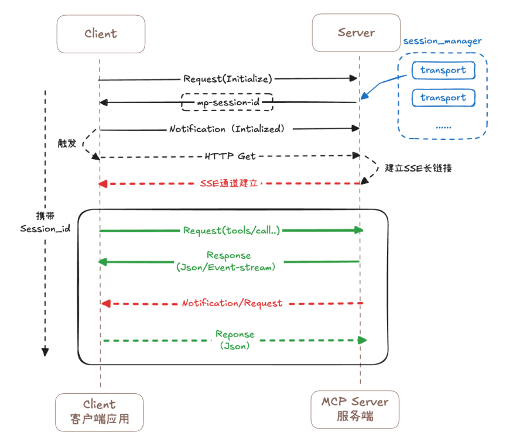

# Agent与MCP零散笔记


## MCP

通信机制function calling 函数调用，不推荐

不同模型有差别，没有统一规范


MCP：模型与远程工具之间的通信协议，有了mcp模型与工具之间就可以完全脱离。的主要目的是解决AI模型因数据孤岛限制而无法充分发挥潜力的难题。


安全问题，有些工具可以基于token登陆认证的方式调用，JWT之类的。

MCP的潜力：没有MCP，AI模型只能在个人电脑上玩，有了MCP协议后可以链接外部工具（互联网数据、企业）整合起来外部资源，提升AI模型的能力。


MCP与Function calling的区别

mcp是协议，function calling是函数调用


### MCP的原理


三种通信机制：

1、基于标准输入输出的本地通信（stdio）：基本没用，要求工具与大模型在同一个进程中

2、基于SSE（Server-Sent Events）的远程通信：本质基于http协议，服务器以事件的方式主动给客服端推送数据，无需客户端明确请求，服务器只要有新的消息，就以事件流的形式推送给客服端，

**现在的http协议默认都是长链接，与这里提到的长链接有什么不同？**

​	三个缺陷：1、在一过程中时间会较长，可能需要20s，如果过程中链接中断，需要客服端重新建立链接，
​				2、需要要求服务端与客服端保持长链接。这对服务器的压力特别大，

​				3、服务端只能通过SSE发送消息

​				4、无状态的服务器不方便使用sse，**为什么？**

3、Streamable-http：属于优化SSE的通信。它的设计理念是在保留SSE优点的同时克服其限制，特别是提供更好的可扩展性和企业环境兼容性。

streamable HTTP是MCP协议在2025年3月引入的一种新传输机制，旨在取代之前的HTTP+SSE传输模式。它的设计理念是在保留SSE优点的同时克服其限制，特别是提供更好的可扩展性和企业环境兼容性。

Streamable HTTP的核心思想是提供一个统一的HTTP端点，同时支持POST和GET方法：

1. POST方法：用于客户端向服务器发送请求和接收响应
2. GET方法（可选）：用于建立SSE流，接收服务器实时推送的消息

与传统HTTP+SSE不同，Streamable HTTP不要求维护单独的初始化连接和消息端点，简化了协议设计并提高了可靠性。

实现一定会发生，虚线服务器支持有状态的情况下会触发，**什么是服务器的有状态与无状态？两种有什么区别？**


**问题：使用streamable必须使用sessionId吗，sessionId是什么？**

```python
http://127.0.0.1:7586/streamable:提示没有sessionId,
{"jsonrpc":"2.0","id":null,"error":{"code":-32600,"message":"Bad Request: Missing session ID"}}
```


mp-session-id。有id就有状态了




相比SSE的优势：

1、简化通信模型


2、支持无状态模式（**最重要**）


3、更好的伸缩性


4、提高可靠性


市面上并不一定Streamable-http取代SSE，一些公司内部可能仍然使用SSE，因为链接的数量不是很多，毕竟只是对内使用，Streamable-http的实现代码要比SSE多。


### FastMCP（是不是市场主流的）


## WorkFlow


工作流：开发者将LLM+tool+...编排组合为一个图，叫工作流。


所有节点和所有的边的输入就是状态State


**重要的三句话：**

1、状态主要是存放整个聊天历史记录以及为完成整个功能所自定义的数据

2、状态在所有节点函数和边函数的输入都默认有状态，状态中的数据在任意节点和边函数中取道

3、所有的节点返回的内容的主要目的就是为了更新状态，所以节点返回的数据更新状态的值，怎么影响（怎么更新）是由状态中定义的reducer函数来决定的。更新操作可能是覆盖、新增、追加


什么是人工干预


