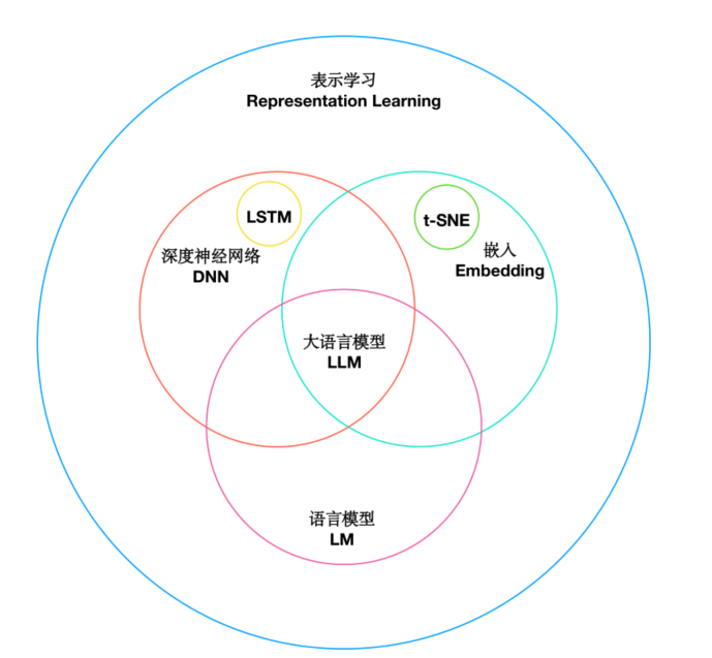

# Embedding


## 计算机中数据的本质

**图片数据本质**：一张彩色图片，在计算机中专为对应的三维矩阵。

**英文数据本质**：ASCII码，每一个英文单词都在对应一个ASCII码。
e.g.  A对应的ASCII为65，十六进制为41


> **UTF-8**： **是一种字符编码规则，用于规定字符如何编码成字节序列。**

```json
字符
↓
Unicode码点
↓
UTF-8编码
↓
010101...
```


**one-hot编码（词汇表）**：让AI的程序算法可以对一堆的字符进行各种计算，计算之前需要对每个字符转化为矩阵，转换的标准就是One-Hot编码。
在机器学习和深度学习中的应用中，文本数据通常需要专为数值型数据，One-Hot编码是一种常用的转换方式，在One-Hot编码中，每个Token表示为一个只有一个元素1，其余元素全为零的向量，向量的长度等于汉字总数量，1的位置表示该汉字的索引，One-hot编码的一个主要优点是它简单直观，当汉字的数量非常大时，One-Hot编码会占用大量的内存。

e.g. 

```java
中文的「玩」字使用One-Hot编码表示：
假设汉族总的有30w个汉字，每个汉字从0-30w依次排好序，「玩」在这个数组中在第4个位置。
那么「玩」使用One-Hot编码表示：[0,0,0,1,0,0,0,...0]（改数组长度为30w）
```


维度太多，计算起来非常复杂，矩阵也好，向量也好维度太多计算量会翻一个量级，在机器学习也好深度学习也好，模型的训练需要花很长的时间。


## 表示学习和嵌入


表示学习包含嵌入，嵌入是表示学习的一种实现方式，一种降维的方式，嵌入可以是词嵌入，图像嵌入，图嵌入等。


表示学习：把数据变成向量/矩阵


### 表示学习

> **表示学习（Representation Learning）是一种思想，而Embedding是表示学习最常见的一种实现方式。**


表示学习关注的是：

> 如何让机器自动学习一种好的数据表示（**Representation**）

而不是把数据变为高维矩阵

例如：
```json
输入
↓
CNN
↓
一个768维向量
```

这就是表示学习


「吵闹」词和词直接从语义/词法上是很相近的，计算机怎么知道的，其实就是在高纬空间中距离计算得出的。

先把话专为向量，然后将这个向量拿到高维矩阵里相关联，很有可能得到一个答案。


所以**表示学习是思想，Embedding是方法**


#### 向量介绍

在文字还没有发明出来的时候，怎么去描述苹果，只能描述苹果的特征：大小，纹路，颜色等等。


计算机中描述苹果：转变为很多维度的向量：[233，4，54,...] 

在做模型训练的时候通过矩阵数据之间的计算把每个物体和其他的管理起来，高纬空间中，都是苹果的离得很近（e.g. 苹果和另一个苹果之间关联起来）。


AI模型内部大量数据都会表示为向量，一个个的向量组成了AI大模型的基石。


### 嵌入学习（Embedding）


#### Embedding的价值

> **把离散对象映射到连续向量空间，并让语义相近的对象距离更近。**

例如：

```json
苹果
↓
[0.21,0.55,...]
```

embedding真正追求的是**语义表示（Semantic Representation）**降维是它的一大特性

```json
1 保留语义

↓

2 连续向量

↓

3 相似计算

↓

4 通常还能降维
```


**1、降维**

​	在许多实际问题中，原始数据的维度往往非常高。例如，在自然语言处理中，如果使用One-hot编码来表示其维度等于词汇表的大小，可能达到数十万甚至更高，通过Embedding，我们可以将这些高维数据映射到一个低维空间，大大减少了模型的复杂度。

​	Embedding并不是：
​	

```json
100 Token

↓

20 Token
```

比如：「苹果很好吃」-> 是3个token


Embedding是：
```json
Token

↓

1536维向量
```

token数没变，只是对比One-Hot描述token的向量维度会少


2、捕捉语义信息

​	Embedding不仅仅是降维，更重要的是，它能够捕捉到数据的语义信息。例如，在词嵌入中，语义上相近的词在向量空间中也会相近。这意味着Embedding可以保留并利用原始数据的一些重要信息。

​	

3、适应性

​	与一些传统的特征提取方法相比，Embeddina是通过数据驱动的方式学习的。这意味着它能够自动适应数据的特性，而无需人工设计特征。


4、泛化能力

​	在实际问题中，我们经常需要处理一些在训练数据中没有出现过的数据。由于Embedding能够捕捉到数据的一些内在规律，因此对于这些未见过的数据，Embedding仍然能够给出合理的表示。


#### Embedding分类

1、词嵌入：在自然语言处理中，词嵌入将词语映射到低维向量空间，以捕捉词语之间的语义和句法关系。通过学习词嵌入，可以将词语表示为连续的向量，其中相似的词语在向量空间中彼此靠近。它在自然语言处理任务中广泛应用，包括**词语相似度计算、文本分类、命名实体识别**等。词嵌入可以通过Word2Vec、GloVe 等方法进行学习。


2、图像嵌入：在图像处理中，图像嵌入将图像映射到低维向量空间，以表示图像的**视觉特征**。这种嵌入方法通常通过使用卷积神经网络(ConvolutionalNeuralNetworks,CNN)等深度学习技术来提取图像的特征表示。


3、图嵌入：是用于学习图结构的表示学习方法，将图中的节点和边映射到低维向量空间中，通过学习图嵌人，可以将复杂的图结构转化为向量表示，以捕捉**节点之间的结构和关联关系**。这些方法可以通过DeepWalk、Node2Vec、GraphSAGE等算法来实现，图嵌入在图分析、社交网络分析、推荐系统等领域中广泛应用用于发现社区结构、节点相似性、信息传播等图属性。


### 词嵌入 Word Embedding


#### Word Embedding 应用

Word Embedding为自然语言处理任务提供了更好的单词表示方法，它的应用主要有:

1、**语义表示和语义相似度**

​	Word Embedding可以捕捉到单词之间的语义关系，使得相似含义的单词在向量空间中彼此靠近，这使得我们可以通过计算向量之间的距离或相似度来度量单词的语义相似度。这对于词义消歧、语义搜索、语义推理等任务非常有用。

我爱吃苹果=我喜欢吃苹果


2、**词语关系和类比推理**

​	Word Embedding可以捕捉到单词之间的关系，如同义词、反义词、上下位关系等。通过在向量空间中进行向量运算，例如求解向量之间的差异或类比推理，我们可以发现词语之间的有趣关系。例如，对于词语之间的类比关系"king-man+woman=queen"，通过Word Embedding可以得到类似的结果。


3、上下文理解

​	Word Embedding可以帮助理解单词的上下文信息。通过学习单词在其周围上下文中的嵌入表示，我们可以捕捉到单词的语境信息，从而帮助解决语义歧义、词语消歧和指代消解等问题.

​	传统Word Embedding（Word2Vec、GloVe）不能很好理解上下文。现代Contextual Embedding（如BERT）已经能够根据上下文生成不同Embedding。

​	**传统Word Embedding（Word2Vec、GloVe）不能很好理解上下文**，是在构建完模型后上下文就固定了，但是上下文是动态的，不同语境上下文的意思都不一样。所以想理解上下文还需要借助语言大模型。单独的word Embedding是很难做到上下文理解的。


4、文本分类和情感分析

Word Embedding可以提供丰富的词语特征表示，从而改善文本分类和情感分析任务的性能。通过将文本中的词语映射为嵌人向量，并将这些向量作为输人特征，我们可以在分类器或情感分析模型中进行训练和预测。


5、机器翻译和生成模型

​	Word Embedding对于机器翻译和生成模型也是至关重要的，通过将源语言和目标语言的单词都映射为嵌入向量，可以提高翻译的准确性和生成模型的质量。嵌入向量可以捕捉到单词之间的语义和句法关系，帮助模型更好地理解和生成自然语言

还有其他分类：

Sentence Embedding

Document Embedding

Multimodal Embedding


#### word Embedding VS Language Model


**Word Embedding**：是静态的，一旦训练完成每个词向量表示就确定，每个词与其他的语义语法就确定了

​	词嵌入通常被用来生成词的向量表示，这个过程通常是**静态**的，即一旦训练完成，每个词的向量表示就确定了。词嵌人的主要目标是**捕获单词或短语的语义和语法信息**，并将这些信息以向量形式表示出来。词嵌入的一个重要特性是，语义上相近的词在嵌入空间中的距离也比较近。然而，词嵌入并不能理解上下文信息，即相同的词在不同的上下文中可能有不同的含义，但词嵌人无法区分这些含义。

**Language Model**：是动态的，会根据输入的上下文变化

​	语言模型则是**预测词序列的概率模型**，这个过程通常是**动态**的，会根据输人的上下文进行变化。语言模型的主要目标是**理解和生成文本**，这包括对上下文的理解，词的预测，句子的生成等等。语言模型会用到词嵌人，但同时也会对上下文进行建模，这样可以处理词在不同上下文中的不同含义。


在某种程度上，你可以将词嵌入看作是语言模型的一部分或者输入，语言模型使用词嵌人捕捉的信息，来进行更深层次的语义理解和文本生成。当然，现在有一些更先进的模型，比如BERT，GPT等，它们生成的是上下文相关的词嵌人，即词的嵌入会根据上下文变化，这样一定程度上弥补了传统词嵌入模型的不足。


语言模型会用到词嵌入，不是Language Model 等同于 Word Embedding


图片：




LLM是一个非常综合性的概念，把各个学科非常重要的东西都用上去，随后形成我们所说的LLM(大预言模型)，会用到Embedding（嵌入）、LM（语言模型）、DNN(深度神经网络)


## 总结-很重要


### 什么是Embedding

Embedding（嵌入）是表示学习（Representation Learning）的一种实现方式，其核心思想是：

> **将离散的数据（文本、图片、节点等）映射为连续的低维稠密向量，使语义相近的数据在向量空间中的距离更近。**


Embedding最大的价值不是单纯降维，而是：

- 将离散数据转换为机器能够计算的连续向量；
- 保留对象之间的语义关系；
- 便于计算相似度、聚类、检索和推荐；
- 同时相比 One-Hot 等表示方式，通常能够降低维度、减少计算量。


**Embedding主要特点**

- 能够捕捉语义信息
- 稠密向量表示（Dense Vector）
- 具有较好的泛化能力
- 便于进行向量计算（相似度、聚类、检索）
- 通常能够降低维度、提高计算效率
- **可解释性较差（属于黑盒表示）**


**Embedding分类**

- Word Embedding（词嵌入）
- Sentence Embedding（句子嵌入）
- Document Embedding（文档嵌入）
- Image Embedding（图像嵌入）
- Graph Embedding（图嵌入）
- Multimodal Embedding（多模态嵌入）


**Word Embedding主要应用**

- 语义表示与语义相似度计算（⭐⭐⭐⭐⭐）
- 相似搜索（RAG最核心）
- 推荐系统
- 聚类分析
- 文本分类
- 情感分析
- 机器翻译
- 问答系统

其中，**对于 AI 应用开发而言，最重要的是语义相似度和向量检索**，这也是 RAG、知识库和推荐系统的基础。


### 结构上理解Embedding-重要

Embedding 并不是为了让LLM”理解文本“，而是为了让计算机”能够比较文本“。

例如：

```js
"苹果手机怎么样？"

↓

Embedding

↓

[0.12, -0.87, 0.55, ...]
```

Embedding不会回答这个问题，它只是把这句话变成一个**向量**，方便和知识库中的其他向量计算相似度，找出最相关的内容，真正负责"理解、推理、生成答案"的是后面的大语言模型（LLM）。

**记住这句话：**

```
Embedding 负责“找”，LLM负责“答”，这是两者最核心的分工。Embedding负责检索（Retrieve），LLM负责生成（Generate）
```


```json
## Embedding在RAG中的作用

用户提问

↓

Embedding模型

↓

向量

↓

向量数据库

↓

相似搜索TopK

↓

返回相关文档

↓

LLM生成答案
```


### RAG的整体流程图

```json
文本

↓

Tokenizer

↓

Token

↓

Embedding

↓

Vector（1536维）

↓

Milvus

↓

TopK

↓

Prompt

↓

LLM
```


