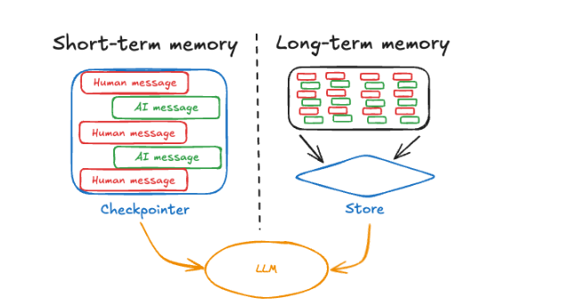

# langgraph

**LangGraph 是用于构建有状态 AI Agent / Workflow 的编排框架。它将 LLM、Tool、Agent、普通业务代码等能力组织成 Graph，通过 State、Node、Edge、条件分支和循环控制整个 AI 工作流的执行。**

**LangChain 更偏向 AI 能力组件及其组合，LangGraph 更偏向复杂 AI 工作流的状态管理和流程编排。LangGraph 中的 Node 可以是 LLM、Tool、普通代码，也可以是一个完整 Agent。**


langgraph是开源，代码开销小，基于流式的

LangChain 和 LangGraph 关注点不同：LangChain 更偏向提供 LLM、Prompt、Retriever、Tool、Agent 等 AI 应用组件；LangGraph 更偏向通过 Graph + State 对这些能力进行有状态的流程编排。两者可以组合使用。

langgraph可以处理一些复杂的定制化高的智能体业务。

lang graph的内存记忆，长期存储与短期存储，具备特点：高并发，


**LangGraph 更像“工作流引擎 + 状态机”**：

```python
                ┌→ RAG Agent ─────┐
                │                  ↓
用户 → 意图判断 ├→ SQL Agent ─→ 结果校验
                │                  ↓
                └→ Search Agent ───┘
                           ↑
                           │
                       结果不合格
                           │
                           └──────
```


## LangGraph 核心组成

Graph：整个 AI 工作流。

Node：工作流中的处理节点，可以是普通代码、LLM、Tool、Agent等。

Edge：定义 Node 之间的流转关系，即一个节点执行完下一步去哪。

Conditional Edge：根据 State / 执行结果动态决定下一步走哪个节点。

AgentState：Graph 运行过程中的动态共享数据，各 Node 可以读取并返回更新。

START：Graph 入口。

END：Graph 结束。


## LangChain与LangGraph

**LangChain 更偏向 AI 应用能力的构建，提供 LLM、Prompt、RAG、Retriever、Tool、Agent 等组件，并把这些组件组合起来完成 AI 能力。**

**LangGraph 更偏向 AI 应用流程的编排，它把 LLM、Tool、Agent 等看成流程中的节点，通过 State、Node、Edge、条件分支、循环等机制，把这些能力组织成一个可控制的 AI 工作流。**

**LangGraph 中的一个节点可以是普通代码、Tool、LLM，也可以是一个完整 Agent；这个 Agent 内部又完全可以使用 LangChain 的能力实现。**


**一个 Agent 也完全可以用 LangGraph**


## Tool工具

**LLM 负责“思考和决策”，Tool 负责“真正干活”。**


Tool 是提供给 LLM/Agent 使用的外部能力，用于扩展大模型本身无法完成的事情，例如查询实时天气、访问数据库、调用业务接口、执行计算等。在 Agent 模式下，LLM 可以根据用户问题和 Tool 描述，自主判断是否调用 Tool、选择哪个 Tool 以及生成调用参数，再根据 Tool 返回结果继续推理，直到得到最终答案。


**LLM 对 Tool 的调用可以自主判断。**

**Tool 自己不会决定什么时候执行。LLM 根据用户问题和 Tool 的描述，自主决定“要不要调用 Tool、调用哪个 Tool、传什么参数”。**


与LangGraph 串起来：**Tool 是能力，Agent 决定怎么使用能力，而 LangGraph 可以进一步控制这些 Agent 和 Tool 按什么流程协作。**


### 创建tool的三种方式


**`@tool`** **装饰器 —— 最常用**

直接把普通 Python 函数转换成 Tool。

```python
from langchain_core.tools import tool

@tool
def get_weather(city: str) -> str:
    """查询指定城市的天气"""
    return f"{city}今天晴天"
```

特点：

- 写法最简单
- 自动根据函数参数生成 Tool 参数结构
- 函数名、描述等会提供给 LLM，帮助 LLM 判断什么时候调用
- **日常开发优先使用**


**从可运行对象（Runnable）创建工具**

接受字符串或 dict 输入的 LangChain [Runnables](https://www.langchain.com.cn/docs/concepts/#runnable-interface) 可以使用 [as\_tool](https://python.langchain.com/api_reference/core/runnables/langchain_core.runnables.base.Runnable.html#langchain_core.runnables.base.Runnable.as_tool) 方法转换为工具，该方法允许为参数指定名称、描述和其他模式信息。

```python
chain = prompt | llm | StrOutputParser()

class ToolArgs(BaseModel):
    topic: str = Field(description="报幕词的主题")
    language: str = Field(description="报幕词采用的语言")

runnable_tool = chain.as_tool(
    name='chain_tool',
    description='这是一个专门生成报幕词的工具',
    args_schema=ToolArgs,
)

```


**继承** **`BaseTool`** **—— 高度自定义**

自己定义一个 Tool 类：

```python
from langchain_core.tools import BaseTool

class WeatherTool(BaseTool):
    name: str = "get_weather"
    description: str = "查询指定城市天气"

    def _run(self, city: str):
        return f"{city}今天晴天"
```

适合 Tool 内部逻辑比较复杂，需要自己控制执行行为的情况。


**最后笔记可以压缩成这张表**

| **创建方式**       | **特点**        | **使用场景**              |
| ------------------ | --------------- | ------------------------- |
| `@tool`            | 最简单、最常用  | 普通函数快速变 Tool       |
| `Runnable.as_tool` | 可显式配置 Tool | 需要更灵活的参数/描述配置 |
| 继承 `BaseTool`    | 自定义程度最高  | 复杂 Tool                 |


一句话总结：**创建 Tool 常见三种方式：****`@tool`** **装饰器、****`从可运行对象（Runnable）创建工具`** **封装函数、继承** **`BaseTool`** **自定义类；本质都是把普通程序能力封装成 LLM 能识别和调用的 Tool，复杂度依次提高。**


## Configurable

configurable：静态配置对象，就是智能体在运行时的相关配置，用户或者使用智能体的人传进来的，在智能体运行中一般是不能改变，在智能体运行中各个地方都能获取到这个值


**configurable 是调用 Graph 时传入的运行时配置参数，用于提供 user_id、thread_id 等在本次执行过程中通常保持不变的信息； AgentState 保存 Graph 执行过程中不断产生和变化的业务数据。**

```python
configurable = 静态运行参数
AgentState   = 动态运行状态
```


## 什么是Agent


通过调用外部工具，自主规划执行推理的能力，形成一个整体系统就是智能体Agent，2025年为智能体元年


三个基本组建：模型、工具、提供指令的提示（提示词）


LLM在一个循环中运行，在每次迭代中，他会选择一个要调用的工具，提供输入，接受结果（一个观察），并利用该观察来指导下一个工作，循环会一直持续，直到满足停止条件----通常是agn t已经收集到足够的信息响应用户

代理循环：LLM选择工具并使用其输出来满足用户的请求


### 什么是AgentState

> **一句话：**AgentState 是 LangGraph 整个 Graph 运行过程中的共享动态数据容器。每个 Node 可以从 State 中读取自己需要的数据，并将执行产生的新数据返回给 Graph 更新 State，后续 Node 再基于更新后的 State 继续执行。因此 State 解决的是不同节点之间的数据传递以及整个工作流运行状态的持续维护问题。


agentState：是一次 Graph Run 执行过程中，各 Node 之间动态共享数据的容器。State 中可以保存 messages、意图识别结果、Tool Result、检索结果等后续流程需要使用的数据。

常用的四种消息类型，humanMessage，AImessage,systemMessage，ToolMessage，这些消息都是存储在agentState中。


1、搞清楚AgentState的作用：存放智能体运行过程中动态产生的各种消息，还可以通过用户编程的方式随意修改、存放消息

2、案例：（给用户发出一个祝福语句）输入username ---> config----> 工具1---> 把username修改到State中------> 工具2----->获取State的username得到最终答案。


图解：

```python
LangGraph Service
    │
    ├── Thread A (会话A)
    │    ├── Graph Run 1
    │    ├── Graph Run 2
    │    └── Graph Run 3
    │
    └── Thread B (会话B)
         ├── Graph Run 1
         └── Graph Run 2
```


### agentState与长期记忆，短期记忆有什么区别


**无论短期记忆还是长期记忆，本质上都是为了解决 LLM 本身无状态的问题。LLM 每次调用都可以理解为一次独立的“第一次见面”，它不会天然记得上一次调用发生了什么，因此应用程序需要在模型外部保存记忆，并在每次调用时把当前任务所需要的短期会话上下文、相关长期记忆以及当前问题重新组织后提供给 LLM。短期记忆解决“当前会话之前聊了什么”，长期记忆解决“跨会话后还有什么值得记住”。**


LangGraph 的 `State`、`Checkpointer`、`Store`，甚至 RAG，其实都可以放进一个更大的框架里理解：**都是在 LLM 调用之前，想办法给这个无状态的模型准备好本次推理所需要的上下文。**

```python
LLM 本身 = 无状态

一次 LLM 调用的输入
=
System Prompt
+ 相关长期记忆
+ 当前会话短期记忆
+ 当前用户问题
+ 必要的 Tool 信息

            ↓

           LLM
            ↓
         本次回答
```


> - **短期存储 = Short-term Memory（短期 Memory）**
> - **长期存储 = Long-term Memory（长期 Memory）**




**AgentState**：一次 Graph 请求（一次 Graph Run）执行过程中，各 Node 之间动态共享数据的容器。

**短期 Memory**：会话（Thread）级记忆，使多次 Graph Run 之间能够保留当前会话的聊天记录、状态等信息。

**长期 Memory**：跨会话（Thread）保存需要长期使用的信息，例如用户偏好、用户资料、重要历史信息等，并不等于简单保存所有会话记录。

**短期 Memory 和长期 Memory 不是二选一**，使用长期存储一定要设置短期存储，长期存储是在短期存储基础上实现

三者可以这样划：

| **概念**        | **生命周期**      | **主要作用**                   |
| --------------- | ----------------- | ------------------------------ |
| **AgentState**  | 一次 Graph 运行   | 节点之间共享动态数据           |
| **短期 Memory** | 一个会话 / Thread | 让 State 跨多次 Graph 调用延续 |
| **长期 Memory** | 跨会话            | 保存用户/业务长期信息          |


#### 短期记忆

LangGraph 的**短期记忆（Short-term Memory）**本质上是通过 **Checkpointer 持久化当前 thread（会话）的 State**。AgentState 不仅是一次 Graph 执行过程中各个节点之间传递数据的容器，也代表当前会话此刻的状态，其中通常包含 `HumanMessage`、`AIMessage`、`ToolMessage` 等聊天历史，也可以包含工具结果、中间变量、任务状态等数据。第一次请求结束后，Checkpointer 会保存 State；下一次使用相同 `thread_id` 请求时，会先恢复之前保存的 State，再与当前输入合并，因此 AgentState 初始化时不一定是空的，而可能已经包含历史会话信息。历史消息较少时，可以保留完整历史并与当前问题一起传给大模型；当历史过多、占用大量 Token 时，可以配置裁剪或摘要策略，将较早的历史压缩成摘要，只保留摘要和近期消息，从而减少 Token 消耗并避免超过模型上下文窗口。因此，**短期记忆不能简单理解为“完整聊天记录”，更准确地说，它是当前 thread 可恢复的会话 State，聊天记录只是其中最核心的一部分。**


#### 长期记忆

LangGraph 的**长期记忆（Long-term Memory）用于保存跨 thread、跨会话后仍然值得保留的信息，例如用户长期偏好、基础信息、长期目标等，它与短期记忆是两套相对独立的机制：短期记忆通常通过 Checkpointer 持久化当前 thread 的** **`AgentState`****，而长期记忆通常通过 Store 独立存储，并不天然属于** **`AgentState`****。哪些内容需要进入长期记忆也不是 LangGraph 自动规定的，可以由用户明确要求“记住”，也可以由开发者制定规则，再让 LLM 判断当前对话中哪些信息具有长期价值并写入 Store。新请求调用 LLM 时，可以根据** **`user_id`** **等条件从 Store 中取得需要的长期记忆，与 AgentState 中的短期上下文以及当前问题共同组装成本次模型输入，即存储时分离，推理时汇合**。长期记忆并不等于向量数据，也不要求必须使用向量数据库：数据量较小时，可以直接使用 MySQL 等关系数据库按 `user_id`、记忆类型等条件查询；当长期记忆非常多，无法全部传给 LLM 时，可以为记忆生成 Embedding，通过向量相似度检索与当前问题语义最相关的 Top K 记忆。此时关系数据库仍适合负责 `user_id`、类型、状态、时间以及 JOIN 等结构化数据管理，而向量检索负责语义相关性搜索，两者可以结合使用；向量数据库通常也支持通过 `user_id` 等 Metadata 先过滤数据范围，再进行向量检索。因此可以把长期记忆理解为：**Store 负责跨会话保存重要信息，结构化查询负责确定“查谁、查哪类记忆”，Embedding + 向量检索在数据量较大时负责确定“哪些记忆与当前问题最相关”，最终将检索出的长期记忆与短期上下文一起提供给 LLM。**


## 什么是workflow


antropic将agent系统划分为两类：

1、第一类是workflow，遵循预定义的工作流，编排LLM和工具，固定代码路径

2、agent，此类agent被定义为完全自主的系统，这些系统在较长时间内独立运行，可以动态指导自身流程和工具系统的使用，通过自身的推理，规划能力，自主控制完成任务


好像智能体更厉害但是：

智能体不能解决所有问题，比如有100个工具，有两个工具有类似的功能，这时候大模型根据上下文做决策的时候它可能会决策失误掉错了，那么当他调错的时候，智能体可能永远都得不到答案，那么就是大模型出现了幻觉。


减小幻觉：将这100多个工具拆分为很多个组，尽量每个组工具的功能和类型不重复，同个组里面智能体在做决策时**减少工具选择错误和幻觉的概率**，由于把工具分为多个组，每个组都分配一个智能体，就出现多个智能体，多个智能体按照一定的编排一定的流程或者顺序形成一个工作流，这就是workflow


**Workflow 不一定需要多个 Agent。只要执行路径主要由代码预先定义，即使只是多个 LLM、Tool、普通 Node 的组合，也可以构成 Workflow。**


对单个智能体来说，它的执行计划完全是由大模型自己决策的，它先调什么工具再调什么工具或者调几次都是有大模型自己决策，那么它就会有很多不可控的因素，LLM现在不能做到100%像人的大脑一样拥有很强的模式识别能力。那么防止智能体由于自主决策所造成的幻觉那么就给agent做固定编排，固定一个节点到另一个节点，自然而然就形成工作流


工作流与智能体是相辅相成的。


langgraph中一切都是图，agent是图中的一个点，使用create_react_agent创建一个agent，并且也得到一个图


**Workflow：执行路径主要由开发者通过代码预先定义；Agent：执行路径主要由 LLM 根据当前情况自主决策。**


