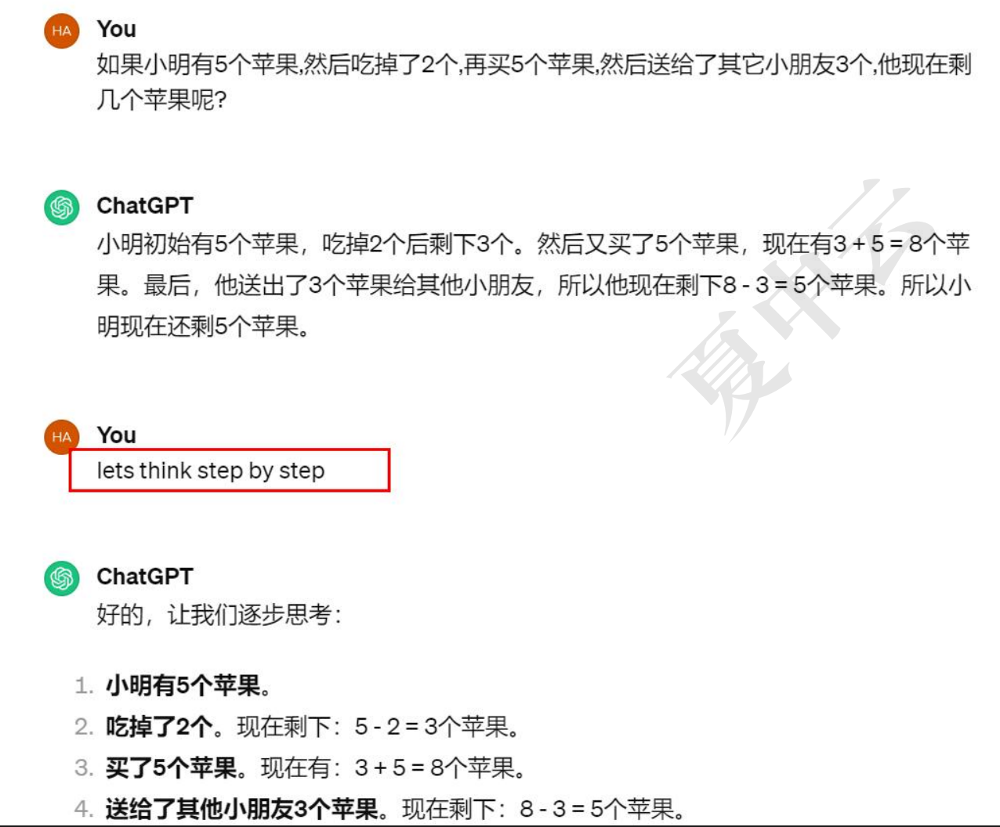

## 整体课程预览

掌握提示词的基础概念，不是很重要， 提示词可以有AI自己生成了

### 副业工具篇

**defy、coze AI 这两个很重要**

spring AI 

ollama-AI大模型部署工具 - 了解即可，可视化的大模型部署

Anthopic MCP 协议，重要，了解MCP是什么及其基本概念，java python调用MCP怎么掉， 以及MCP怎么开发

MCP 还在快速发展迭代中，可能会出新的通信协议，所以还没有进入稳定期，

### 基础篇

以了解为主，快速过一遍

什么是机器学习、深度学习、有监督学习，神经网络

**整个过程学习完后再学习一边AI大模型理论基础，过一遍方便面试**

面试可能会问到一些基本概念

#### prompt：

**Prompt 不需要成为专家。**

##### 提示词的四要素

指令+背景+输入+输出

指令：想要模型执行的特定任务，e.g. 总结，生成代码，翻译等等
背景：包含上下文信息和额外的外部信息，引导语言模型更好的输出，**角色扮演**

e.g. 我是x x x x，你是一名P8高级java架构师...

输入：用户输入内容或者问题

e.g. 总结时提供的问题，需要推理的问题，编写s q l代码提供的数据库表

输出：指定输出的格式或者类型

e.g. 4句话，1000字以内，json格式，markdown格式

##### prompt和prompt engineering

prompt：与大模型交互的信息，更好的提示词能让大模型更好的为你工作。e.g. 问大模型什么是提示词，可能会回答是个英语单词，那么重新问：LLM中什么是提示词，那么大模型就会对LLM的prompt概念进行回答

prompt engineering（提示词工程）：帮助LLM应用于各个场景，并且工作得专业，准确。

白话版：提示词工程就是不断的调教优化LLM让他能工作得更好

e.g. 某个医疗行业，大模型可能不知道某个医疗行业的知识，那么你将这个医疗行业的知识喂给大模型，让大模型去吸收优化学习等等，让大模型具备这个医疗行业的专业知识，那么整个就是prompt engineering。比如让大模型成为建筑行业的专家，给建筑方面的知识。

##### 零样本与少样本

**零样本提示（zero-shot prompting）**：希望零样本的能力更强，输入的prompt中没有示列样本

e.g. 

1、判断以下文本的情感，输出正向，负向，或者中性，无需其他说明和解释文本：这本书虽然讲的比较清晰，适合新手，但是对我来说作用不大，不值得购买

2、我有100块钱购物券，公司又送了2张购物券，每张200元，我想买4桶奶粉,剩下来的钱买面包，奶粉每桶100元，面包20一斤,我可以买几桶奶粉,几斤面包？请直接给出答案

**零样本思维链**：通过「lets think step by step」激发零样本思维链

 

**少样本提示（few-shot prompting）**：输入的prompt里面有少量的提示样本，LLM如果不能给你理想的结果，可以在prompt里面给它列子，或者一些推理过程，来让大模型更好的处理输出

e.g. 
这很棒！// 负面 

这很糟糕！// 积极 

哇，那部电影太棒了！// 积极 

多么可怕的表演！//

少样本思维链：通过提示词激发LLM一步一步的去思考

下面这些必须懂：

- Prompt Template
- Role
- Few-shot
- JSON Output
- Temperature
- Prompt Injection
- Guardrails

也就是说：

**不用研究 Prompt Engineering 的高级技巧。**

但是：

**项目里面用到的 Prompt 必须理解。**

直播课一期里：**面试指导**

python入门：作重在python核心基础课程即可，进阶篇其实与java差不多

### 应用篇

建议先从：「langchain+langgraph+MCP的智能体」开始学

学完后直接做项目：1、携程AI项目；2、RAG企业知识库项目；3、多模态RAG+RAGAS实战项目

去年老项目不学：「AI大模型实践项目」

###### AI中数据的本质

**图片数据本质**：一张彩色图片，在计算机中专为对应的三维矩阵。

**英文数据本质**：ASCII码，每一个英文单词都在对应一个ASCII码。
e.g.  A对应的ASCII为65，十六进制为41

**UTF-8**：将字符转化为二进制码让计算机能识别。

**one-hot编码（词汇表）**：让AI的程序算法可以对一堆的字符进行各种计算，计算之前需要对每个字符转化为矩阵，转换的标准就是One-Hot编码。
在机器学习和深度学习中的应用中，文本数据通常需要专为数值型数据，One-Hot编码是一种常用的转换方式，在One-Hot编码中，每个汉字表示为一个只有一个元素1，其余元素全为零的向量，向量的长度等于汉字总数量，1的位置表示该汉字的索引，One-hot编码的一个主要优点是它简单直观，当汉字的数量非常大时，One-Hot编码会占用大量的内存。

维度太多，计算起来非常复杂，矩阵也好，向量也好维度太多计算量会翻一个量级，在机器学习也好深度学习也好，模型的训练需要花很长的时间。

**有没有好一点的方式解决维度太长的问题**，降维，有的：**基于深度学习的语言模型**这种技术将每个字或者词映射到一个高维向量（称为词嵌入），这个向量可以捕捉到字/词的语义信息。

e.g. 

### 进阶篇

